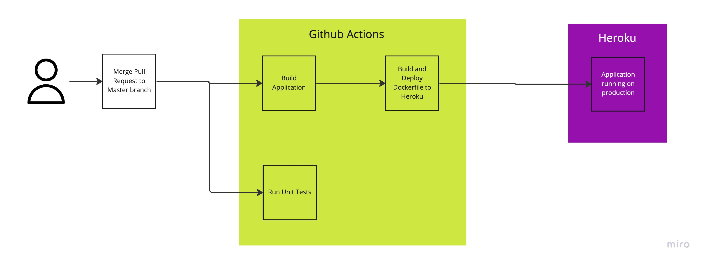

# CSC301 - Assignment 2

## Production Deployment

The application is deployed: https://assignment-2-12-gjchow-ranachi.herokuapp.com/

## Application


## Running Unit Tests

Unit Tests can be run both locally and as part of the CI/CD pipeline. Developer can easily scale up the amount of unit tests and the application will be able to run them without changing anything else.

### Locally

1. Clone the application locally and go the root directory
2. Run the following commands

```
cd client
npm install
npm test *
```

### Using GitHub Actions

The unit tests are also part of the CI/CD pipeline:


## CI/CD Process



## Local Development

### Frontend

1. Clone the application locally and go the root directory
2. Run the following shell commands

```
cd client
npm install
npm start
```

### Backend (Frontend served as static files)

1. Clone the application locally and go the root directory
2. Run the following shell commands

```
cd client
npm install
npm run build
cd ..
cd server
npm install
npm start
```

## References

This application is largely based on the following tutorials (repository structure, package.json for client and backend): 
* https://www.youtube.com/watch?v=lR1gR9WhY10
* https://www.youtube.com/watch?v=swgH9MGM9nM
* The code from the tutorials is: https://github.com/SparkDevTeams/ds2020_mauricio.

Dockerfile is based on this guide:
* https://nodejs.org/en/docs/guides/nodejs-docker-webapp/

Mongoose Schemas is based on the documentation:
* https://mongoosejs.com/docs/guide.html

For setting up state management in React:
* https://redux.js.org/tutorials/fundamentals/part-3-state-actions-reducers

For setting up Heroku Deployment using Github Actions:
* https://github.com/marketplace/actions/deploy-to-heroku

For setting up Nodejs building and testing using Github Actions:
* https://github.com/actions/setup-node


## Authors

* Chirag Rana
* Gabriel Chow
